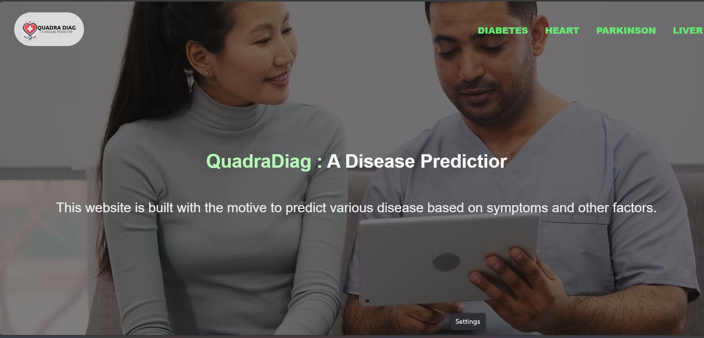

# 🏥 Quadra Diag : Disease Prediction

A machine learning-based **disease prediction system** that can **simultaneously identify multiple diseases** including **Heart Disease, Liver Disease, Parkinson’s Disease, and Diabetes** using Flask API. This system aims to provide **accurate, real-time predictions** by analyzing patient parameters.

---

## 🚀 Features
✅ Multi-disease prediction in one model
✅ Uses **XGBoost, SVM, Logistic Regression**
✅ Flask API for seamless integration
✅ Supports real-time prediction using **pickle files**
✅ Scalable—more diseases can be added

---

## 📌 Project Overview



This system processes **medical data** collected from various datasets and applies **machine learning algorithms** to predict diseases accurately. The model is deployed using **Flask**, allowing users to input patient parameters and receive disease predictions instantly.

### **🔍 Diseases Covered:**
- 🫀 **Heart Disease**
- 🏥 **Liver Disease**
- 🧠 **Parkinson’s Disease**
- 💉 **Diabetes**

---

## 📊 Tech Stack

| Component           | Technology Used |
|--------------------|----------------|
| Backend | Python, Flask |
| Machine Learning | XGBoost, SVM, Logistic Regression |
| Data Processing | Pandas, NumPy, Scikit-Learn |
| Frontend (Optional) | HTML, CSS, JavaScript |
| Deployment | Flask, Pickle |

---

## ⚙️ Installation & Setup

1️⃣ **Clone the repository:**
```bash
git clone https://github.com/khushi11saxena/Quadra-Diag.git
cd Quadra-Diag
```

2️⃣ **Create a virtual environment (optional but recommended):**
```bash
python -m venv venv
source venv/bin/activate  # On Windows use: venv\Scripts\activate
```

3️⃣ **Install dependencies:**
```bash
pip install -r requirements.txt
```

4️⃣ **Run the Flask API:**
```bash
python app.py
```

5️⃣ **Access the app in your browser:**
```
http://127.0.0.1:5000/
```

---

## 🛠 Methodology

### **📌 1. Data Collection**
- **Diabetes:** PIMA Indian dataset, UCI ML Repository
- **Liver Disease:** ILPD benchmark dataset, Taipei City Hospital records
- **Heart Disease:** UCI repository (Hungarian, Switzerland, Cleveland patients)
- **Parkinson’s Disease:** PPMI dataset

### **📌 2. Data Preprocessing**
- Handling missing values
- Feature scaling & encoding
- Removing duplicates

### **📌 3. Model Training**
- Algorithms used: **XGBoost, Decision Trees, KNN, Naïve Bayes, Random Forest, SVM**
- Data split: **80% training, 20% testing**

### **📌 4. Model Deployment**
- Trained models saved as **Pickle (.pkl) files**
- Integrated with Flask API for real-time predictions

---

## 🎯 How It Works

📌 **Step 1:** User enters medical parameters.

📌 **Step 2:** The system processes input data and applies the trained model.

📌 **Step 3:** The system returns a prediction with confidence score.

📌 **Step 4:** Users receive results and suggested medical consultation.


---

## 📷 Screenshots
### **🔹 Input Form for Disease Prediction**


### **🔹 Prediction Result Example**


---

## 🏆 Future Enhancements
✅ Expand to more diseases (e.g., Cancer, Kidney disease)
✅ Improve accuracy using Deep Learning models
✅ Develop a user-friendly frontend
✅ Implement real-time API for integration with hospitals

---

## 📜 License
This project is licensed under the **MIT License**.

---

## 💡 Contributors
👩‍💻 **Khushi Saxena** ([@khushi11saxena](https://github.com/khushi11saxena))

Feel free to contribute and improve the project! 🚀

---

## 📞 Contact
📧 **Email:** your-email@example.com  
🔗 **GitHub:** [Quadra-Diag](https://github.com/khushi11saxena/Quadra-Diag)
